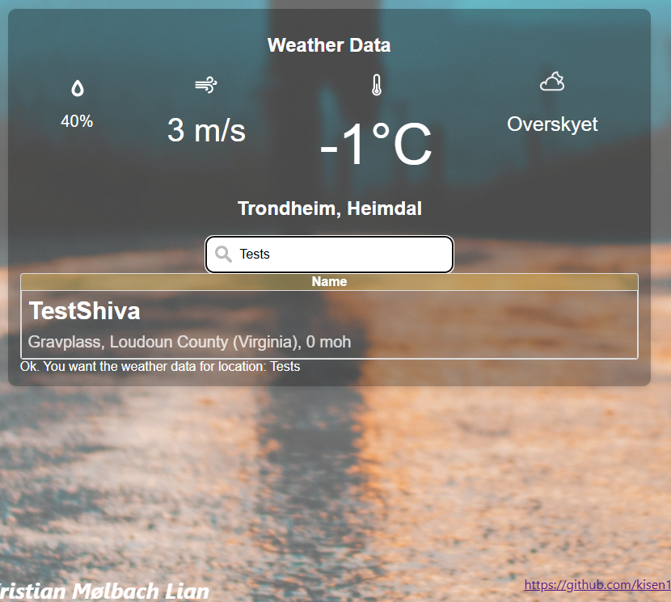

# WeatherApp
This is a project to learn TypeScript with React first and foremost. 

Here is how it looks as of today:

### Change notes
- 30.11.2024: The development has run into a CORS-roadblock, one which might require some rewriting and restructuring the project.

- 01.12.2024: Some location-search-queries work just fine, others are CORS-blocked. Naturally, the difference between the queries that do work, and those that don't, is the existence of Access-Control-Allow-Origin. In the queries that do work, is is set to *, in the queries that don't work, it isn't a part of the response header at all.

- 01.12.2024: Made the search results not resize the weather widget

## (ClothesForRunningApp)
At a point, this App is intended to be a program to decide what kind of clothes one should wear for taking a run where you are at. It should be able to support uploading images of your clothes and take in a rating system where you could rate how much each piece of clothing fit for the current weather you just ran in.