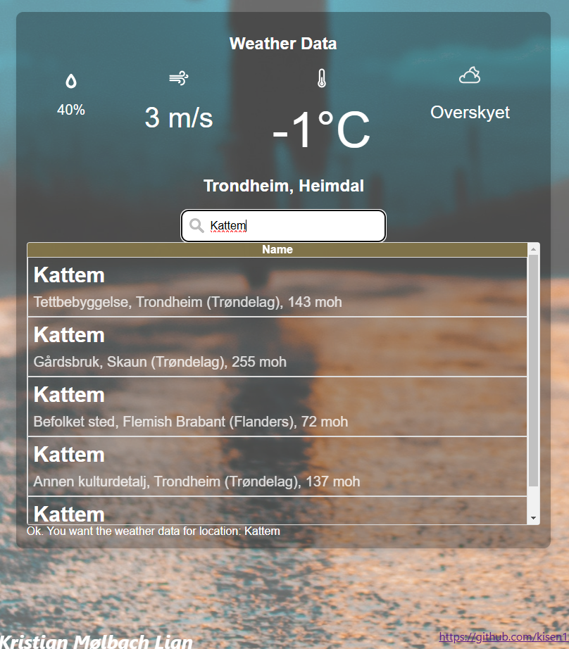

# WeatherApp
This is a project to learn TypeScript with React first and foremost. As of 30.11.2024, the development has run into a CORS-roadblock, one which might require some rewriting and restructuring the project.

## (ClothesForRunningApp)
At a point, this App is intended to be a program to decide what kind of clothes one should wear for taking a run where you are at. It should be able to support uploading images of your clothes and take in a rating system where you could rate how much each piece of clothing fit for the current weather you just ran in.